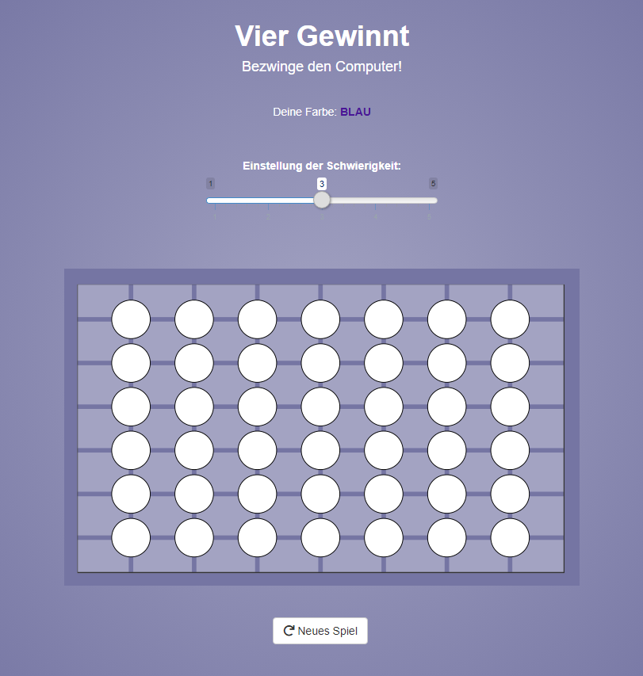

<!-- README.md is generated from README.Rmd. Please edit that file -->

# Vier gewinnt\!

Ein kleines Mini-Projekt, um den Minimax Algorithmus auszuprobieren.
Ergebnis: Ein nicht sehr schlauer, aber auch nicht sehr dummer AI-Gegner
für das Spiel Vier Gewinnt. Dazu eine Shiny-Web-Application zum
Spielen:)

## Link zum Spiel

[Hier klicken](https://esommer.shinyapps.io/vier_gewinnt_pretty/)

## Teaser

